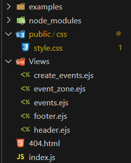

# Implementation of the project

In this project I had to go throw multiple tasks to pass.There are 27 tasks to finish till *25/05/2023 12:00 GMT +3*   

<details>
  <summary>1. Fișiere separate pentru HTML și CSS</summary>
  

  
</details>

<details>
  <summary>2. Folosiți elemente semantice</summary>
  
  Am folosit Header si Footer in proiect. 
  Se pot de asemenea regasi in [Header](/Project/Views/header.ejs) sau [Footer](/Project/Views/footer.ejs)

  ### Some Code
  ```html
        <header class="navbar">
        <ul>
            <span><%=title%></span>
            <li class="dropdown">
              <a href="javascript:void(0)" class="dropbtn">Not satisfied?</a>
              <div class="dropdown-content">
                <a href="https://cloud.google.com/events?hl=en&ser">Search on Google</a>
                <a href="https://github.com/MihaiB-dev/Laborator-Tehnici-Web/tree/master/Project">Contribute on github</a>
                <a href="https://github.com/MihaiB-dev/Laborator-Tehnici-Web/blob/master/Project/README.md">About Implementation</a>
              </div>
            </li>
            <li><a href="/create_event">Create Events</a></li>
            <li><a href="/">Home</a></li>
          </ul>
      </header>
  
  ```
  ```html
    <footer>

        <p style="text-align:center; opacity:50%;">@Bivol Mihai 2023</p>
    </footer>
  
  ```
  
</details>

<details>
  <summary>3.Folosiți majoritatea selectorilor CSS (cei de bază, pseudo-clase și peseudo-elemente, combinatori)</summary>
  
  Am folosit :    
  - selectori pe baza numelui, a clasei, a id-ului
  - pseduo selectori precum hover, focus

  ```css
    body {
  background-color: #F6F1F1;
  min-height: 100vh;
  margin:0px;
  padding:0px;

  display: flex;
  flex-direction: column;
  justify-content: space-between;
    }
    .All_elements{
  margin-left:2rem;
  margin-top:2rem;
    }
    .navbar ul {
  list-style-type: none;
  margin: 0;
  margin-top:5px;
  padding: 0;
  overflow: hidden;
  background-color: transparent;
    }
    #create_event_form input:focus, textarea:focus{
    border: 1px solid #19A7CE;
    outline: none;
    }
    #create_event_form button:hover {
    background: #146C94;
    color:white;
    }
    .event_container > img {
    display:block;
    margin-left:auto;
    margin-right: auto;
    height:auto;
    width:200px;
    border-radius: 1rem;
    }

  ```
</details>